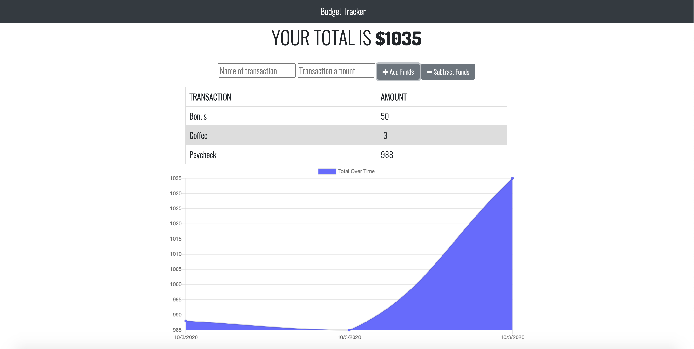

# Budget Tracker

## Description
Budget Tracker is a progressive web application that helps users keep track of their finances. Users are able to add expenses and deposits to their budget with or without a connection. If the user enters transactions offline, the total is updated when they are brought back online. The application shows the users total amount, a table with their transactions, and a chart displalying how their total balance has changed over time. 

## Table of Contents
[Installation](#Installation)  
[Screenshots](#Screenshots)  
[Contact](#Contact)

## [Installation](#Installation)
To use Budget Tracker, visit https://mighty-citadel-30446.herokuapp.com/.

## [Screenshots](#Screenshots)

## [Contact](#Contact)
To see more of my work, visit my GitHub profile: [alirueter](https://github.com/alirueter)

If you have any questions, you can contact me at rueter.alison@gmail.com.
    
